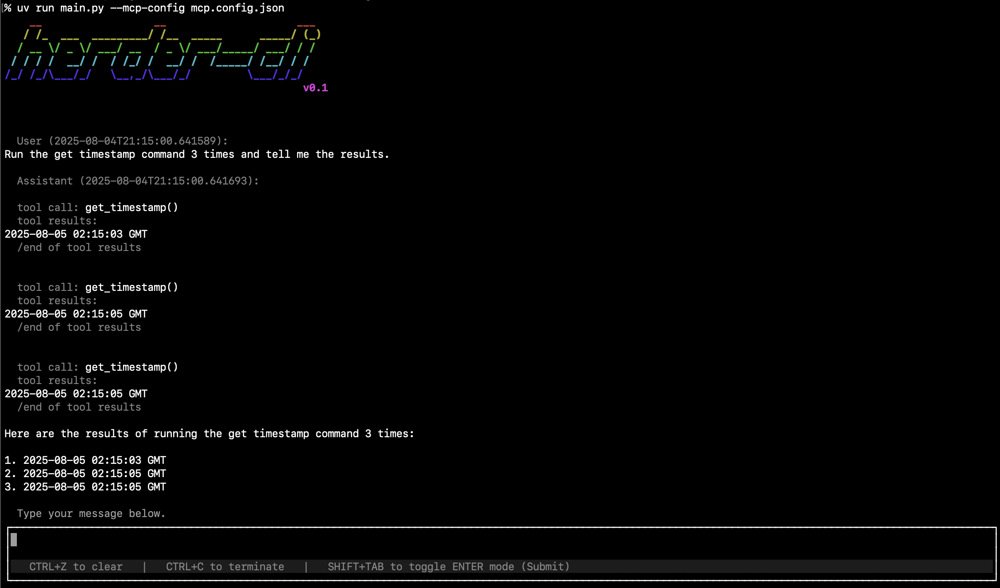

# Herder
A terminal chat utility for Ollama providing MCP support.

You need [Ollama](https://ollama.com/) installed for this utility.

Using `uvx` you can run `herder` with just `uvx herder-cli@latest`.



This also supports running without an input prompt, which makes scheduling a task easy with [crons](https://en.wikipedia.org/wiki/Cron).
```console
# uvx herder-cli@latest --prompt 'What is my name.' --history-file history.log --no-banner
Installed 51 packages in 37ms
  User (2025-08-05T19:38:46.143672):
What is my name.

  mistral-small3.2:24b (2025-08-05T19:38:46.143695):
I'm sorry, but I don't have access to personal information about users, including names. How else can I assist you today?

# uvx herder-cli@latest --prompt 'We are doing a memory test. The name is Sam.' --history-file history.log --no-banner
Installed 51 packages in 38ms
  User (2025-08-05T19:39:08.818119):
We are doing a memory test. The name is Sam.

  mistral-small3.2:24b (2025-08-05T19:39:08.818135):
Thank you for letting me know, Sam! It's great to meet you. How else can I assist you today?

# uvx herder-cli@latest --prompt 'What was my name?' --history-file history.log --no-banner
Installed 51 packages in 38ms
  User (2025-08-05T19:39:21.104007):
What was my name?

  mistral-small3.2:24b (2025-08-05T19:39:21.104028):
In our previous interaction, you mentioned that your name is Sam. Is there anything else I can help you with?
```

## Working Features
- Chatting with Ollama models.
- MCP server configuration.
- Tool calling.

## Features in Progress
- Tool call approval confirmation.
- Autoapprove options/configuration.
- Default tools: Sandboxed file access, Command calling
- Automatic context compaction.

## Nice Haves
- Would be great to figure out how to support shrinking the message box on terminal resize.
